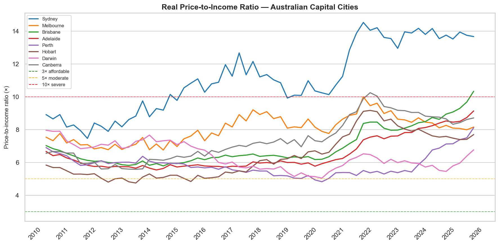
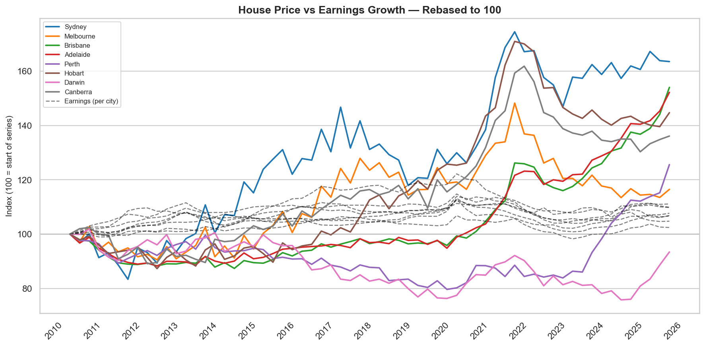
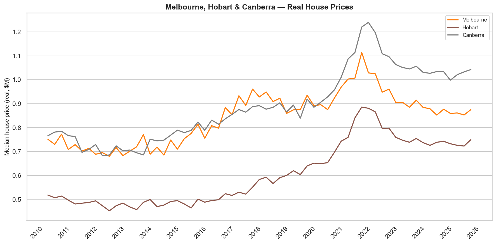
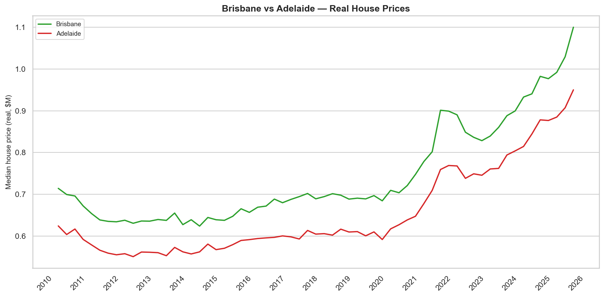
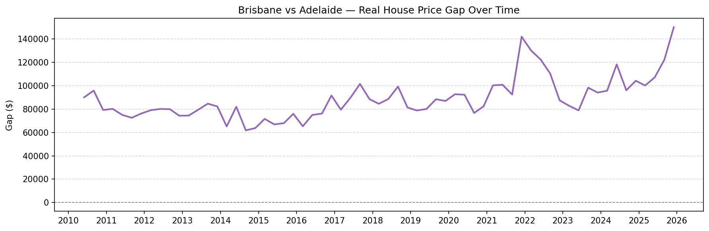
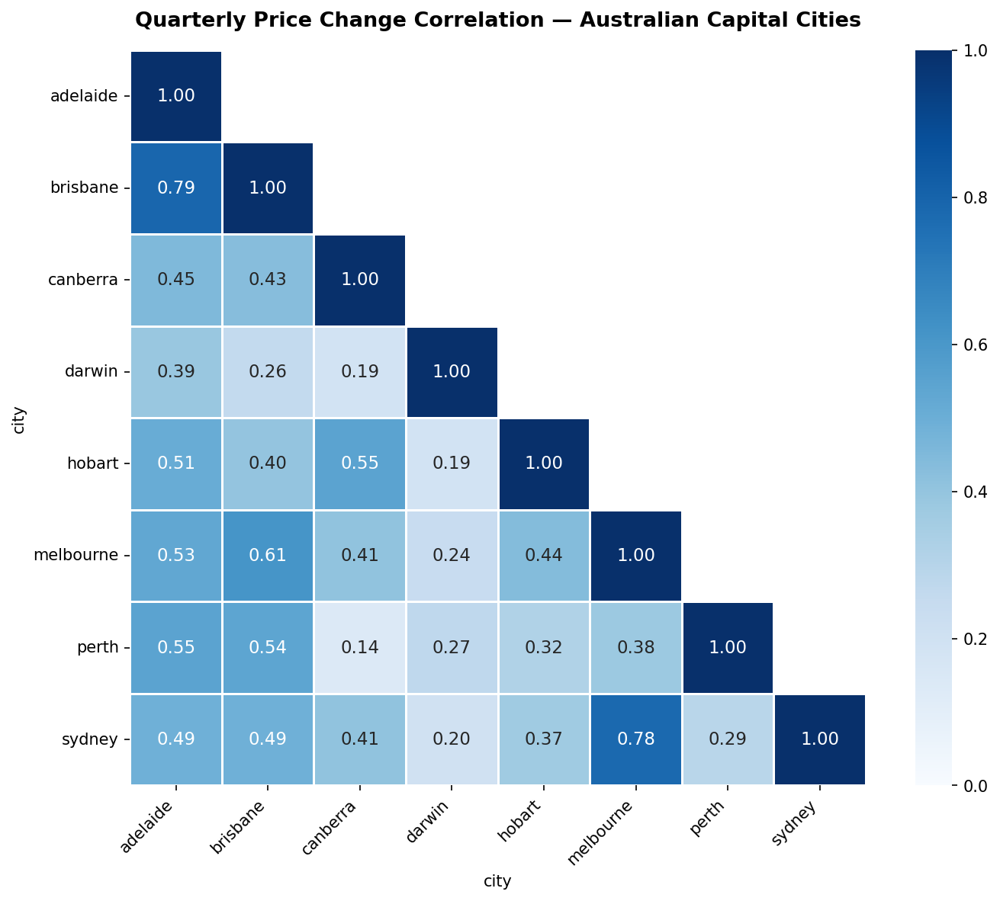

# 🏠 Australian Housing Affordability (2010–2026)

Interactive analysis of house price affordability across Australia's 8 capital cities, using CPI-adjusted ABS data spanning 15 years.

**[View interactive chart →](https://lukas-pb.github.io/housing_affordability)**

---

## Key findings

**1. House prices have completely disconnected from wages**
Between 2010 and 2026, earnings grew by just 10–15% in real terms across all capital cities. Over the same period, real house prices increased by over 70% in Sydney and between 30–50% in most other capitals. The gap between the two series has widened every decade.

**2. Every capital city is now severely or seriously unaffordable**
Using the Demographia price-to-income benchmark, no Australian capital city is close to affordable. Sydney and Brisbane have crossed 10× — the threshold for "severely unaffordable" — with Sydney peaking above 14× during the 2021–22 boom. Every other capital sits between 6× and 9×. No city has stayed below the 5× "moderate" threshold for more than a month or two.

**3. The COVID boom and bust hit Melbourne, Hobart and Canberra hardest**
These three cities moved in near lockstep — surging sharply through 2021 and peaking around late 2021 to early 2022, before giving back significant value. As of 2026 none have recovered to their peak in real terms, while cities like Brisbane, Adelaide and Perth continued climbing through the same period.

**4. Brisbane and Adelaide are more correlated than Sydney and Melbourne**
A quarterly price change correlation analysis produced a surprising result — Brisbane and Adelaide (r = 0.79) are more tightly linked than Sydney and Melbourne (r = 0.78). Both cities appear to respond to the same national demand signals, likely driven by shared interstate migration patterns and being the primary "value" alternatives for buyers priced out of the two largest markets.

**5. The Brisbane–Adelaide price gap has been stable but is now widening**
Despite near-identical trend movements, Brisbane has consistently traded at a $70,000–$100,000 premium over Adelaide in real terms for most of the past 15 years. That gap blew out to $140,000+ during the 2021–22 Brisbane surge, compressed as Adelaide caught up, and has since widened again to $150,000 as of early 2026 — suggesting Brisbane's recent acceleration is outpacing Adelaide's.

**6. Darwin is the only capital where real house prices declined**
Every other capital city ended 2025 with real house prices substantially above 2010 levels. Darwin is the exception — prices fell through the mid-2010s and have never recovered, reflecting the territory's economic exposure to mining cycles and weak population growth relative to the eastern seaboard.

**7. Perth had the most dramatic short-term surge in the dataset**
After being one of the weakest performers for most of the decade, Perth's median house price jumped approximately $300,000 in real terms in under 2.5 years — one of the sharpest city-level price accelerations in the dataset.

---

## Charts

### Real price-to-income ratio — all capital cities
*PTI = median house price ÷ annual earnings. Affordability thresholds follow Demographia methodology.*


> ⚠️ Note: earnings are state-level averages. PTI ratios may be slightly overstated for capital city workers.
---

### House price vs earnings growth — rebased to 100
*Both series rebased to 100 at the start of the dataset. Dashed lines = earnings per city. The widening gap is the affordability crisis visualised.*



---

### Melbourne, Hobart & Canberra — real house prices
*Three cities that surged together through COVID and corrected together. None have recovered to their 2022 peak in real terms.*



---

### Brisbane vs Adelaide — real house prices
*Two cities with near-identical trend movements but a persistent price gap of $70k–$150k.*



### Brisbane vs Adelaide — price gap over time
*The gap has been surprisingly stable for most of the period, with notable blow-outs during the 2021–22 Brisbane surge and again in 2025–26.*



---

### Quarterly price change correlation matrix
*Pearson correlation on quarter-on-quarter price changes across all 8 capitals. Brisbane–Adelaide (0.79) edges out Sydney–Melbourne (0.78) as the most correlated city pair. Darwin has the weakest correlation with every other city.*



---

## Data sources

| Dataset | ABS catalogue | Description |
|---------|--------------|-------------|
| Residential property prices | 6416.0 | Median price of established house transfers, quarterly |
| Average weekly earnings | 6302.0 | Ordinary time cash earnings, full-time adults, private & public sectors |
| Consumer Price Index | 6401.0 | All groups CPI, capital cities |

---

## Methodology

**CPI adjustment**
All price and earnings series are adjusted to the latest available CPI quarter using:
```
real_value = nominal_value × (CPI_latest_for_city / CPI_at_period)
```
CPI reference is the latest date per city, so each city's series is expressed in that city's most recent dollar terms.

**Price-to-income ratio**
```
PTI = median_house_price / (weekly_earnings × 52)
```
⚠️ **Limitation — state-level earnings:** Earnings data (ABS 6302.0) is published at the state level, 
not city level. Capital city workers typically earn above the state average, meaning PTI ratios in 
this analysis are likely slightly overstated — houses appear less affordable than they truly are for 
the average city worker. City-level earnings data is not publicly available from the ABS at this time.

**Correlation analysis**
Pearson correlation is calculated on quarter-on-quarter percentage changes rather than price levels, to avoid spurious correlation from two independently trending series.

**Affordability thresholds** follow [Demographia International Housing Affordability](http://www.demographia.com/dhi.pdf):

| PTI | Rating |
|-----|--------|
| ≤ 3× | Affordable |
| 3–5× | Moderately unaffordable |
| 5–10× | Seriously unaffordable |
| > 10× | Severely unaffordable |

---

## Repo structure

```
housing_affordability/
├── docs/
│   ├── index.html          # Interactive Plotly chart (GitHub Pages)
│   └── data.csv            # Full dataset — all cities, all quarters
├── assets/                 # Chart images embedded in this README
│   ├── pti_real.png
│   ├── decomposition.png
│   ├── melb_hob_canb_prices.png
│   ├── bris_adel_prices.png
│   ├── bris_adel_gap.png
│   └── correlation_matrix.png
├── notebooks/
│   └── analysis.ipynb      # Data cleaning, CPI adjustment, all charts
├── README.md
└── .gitignore
```

## Running locally

Open `docs/index.html` directly in a browser, or run a local server to avoid CORS issues with the CSV:

```bash
cd docs
python -m http.server 8000
# open http://localhost:8000
```

---

## License

MIT
